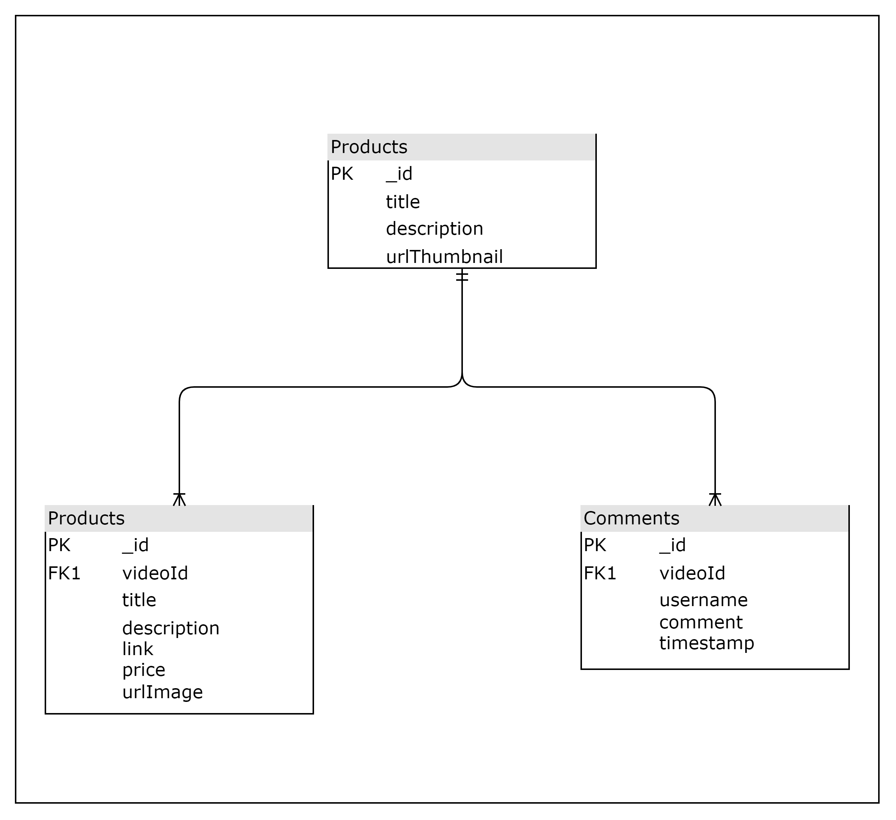

# Midterm

## Database Structure



## API Structure and Response

## **GET /video**

```
Request:
GET http://localhost:3005/api/video

Response:
{
    _id: ""
    "title": ""
    "description": ""
    "urlThumbnail": ""
}
```

## **GET /product/:videoId**

```
Request:
GET http://localhost:3005/api/product/:videoId

Params:
videoId

Response:
{
    _id: ""
    title:""
    description:""
    link: ""
    price: Number
    urlImage:""
}
```

## **GET /comment/:videoId**

```
Request:
GET http://localhost:3005/api/comment/:videoId

Params:
videoId

Response:
{
    _id: ""
    username: ""
    comment: ""
    createdAt: Date
    updatedAt: Date
}
```

## **POST /comment**

```
Request:
POST http://localhost:3005/api/comment

Body
{
    videoId: ""
    username: ""
    comment: ""
}

Response:
{
    Status Code : 200, Message: "Success"
    OR
    tatus Code : 500, Message: "Fail"
}
```

## **How to run local**

1. Clone this repo
2. npm Install
3. Copy env.example to .env
4. npm run start
